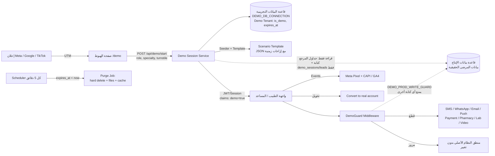
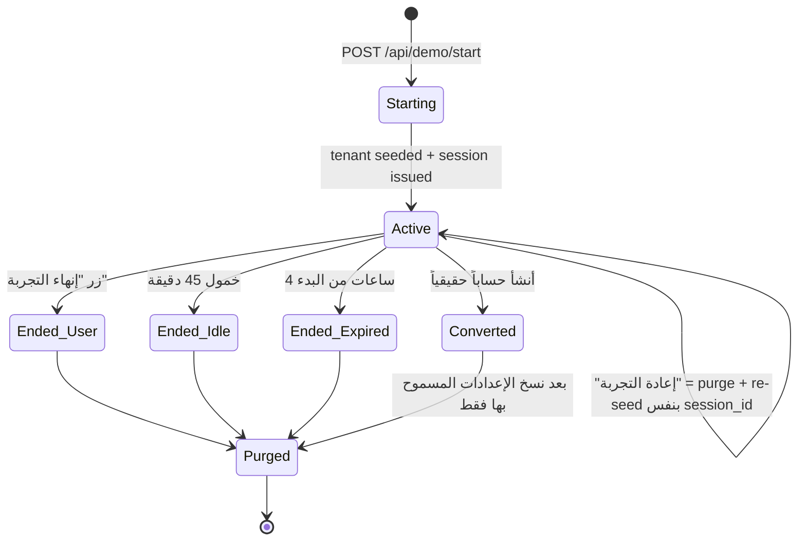

# مستشفاون — تصميم بيئة التجربة (Demo Sandbox) للأطباء والمساعدين

**الإصدار:** 1.1 — 4 سبتمبر 2026 (تحديث: العزل عبر قاعدة بيانات تجريبية منفصلة يوجّهها `.env` — القسم 2.1)
**الحالة:** مسودة تخطيط (لا يوجد كود بعد)
**الجمهور:** Helmi + وكيل Claude Code داخل الـ IDE (الملف التنفيذي المرافق: `02-claude-code-implementation-brief-EN.md`)

---

## 0. الفكرة في سطرين

طبيب يضغط على إعلان → يفتح مستشفاون بدون تسجيل → يجد نفسه داخل **عيادة كاملة شغّالة اليوم**: حالات منتهية من الأسابيع الماضية، حالة **على الكرسي دلوقتي**، وحالات **في الانتظار** بمواعيد اليوم والأيام القادمة. يجرّب كل شيء (الكشف، الروشتة، الفواتير، إعدادات العيادة، صلاحيات المساعد، التقارير…)، يبدّل بين دور الطبيب ودور المساعد، ثم تنتهي التجربة وتُمسح كل آثارها تلقائياً — وتُترك له طريقة واحدة واضحة لإنشاء حسابه الحقيقي.

المصطلح الذي سنستخدمه في الكود: **Demo Mode / Demo Tenant** (وليس "test environment" حتى لا يختلط مع بيئة الـ QA/staging).

---

## 1. المتطلبات

### 1.1 متطلبات وظيفية (من طلبك)

| # | المتطلب | ملاحظة تصميمية |
|---|---------|----------------|
| F1 | الدخول كطبيب أو كمساعد وخوض التجربة كاملة | مستخدمان مُنشآن مسبقاً داخل عيادة تجريبية واحدة، مع زر تبديل الدور |
| F2 | حالات سابقة (منتهية) | زيارات مكتملة بتشخيص وروشتة وفاتورة مدفوعة، بتواريخ **-45 يوم إلى -1 يوم** |
| F3 | حالة تحت الكشف الآن | زيارة بحالة `in_progress` بدأت قبل **دقائق** من لحظة بدء التجربة |
| F4 | حالات منتظرة | مواعيد اليوم (بعد الآن) + الأيام القادمة، بعضها `checked_in` وبعضها `booked` |
| F5 | التواريخ مرتبطة باليوم الذي تجري فيه التجربة | كل التواريخ في قالب البذر (seed) تُخزَّن كـ **إزاحات** (`D-14`, `D0 +30m`) وتُحسب لحظة الإنشاء بتوقيت القاهرة |
| F6 | تجربة إعدادات العيادة وكل الإمكانيات | لا تعطيل لأي شاشة؛ فقط **قطع الآثار الخارجية** (رسائل، دفع، اتصالات) |
| F7 | كل تعديل يُلغى بانتهاء التجربة | كل بيانات التجربة معزولة داخل Tenant تجريبي يُحذف بالكامل (hard delete + ملفات) عند الانتهاء |

### 1.2 متطلبات غير وظيفية

- **بدون تسجيل** قبل الدخول (الاحتكاك يقتل تحويل الإعلانات) — جمع البيانات يحدث *بعد* أن يرى القيمة.
- **زمن بدء التجربة < 3 ثوانٍ** من الضغط على الزر حتى ظهور لوحة الطبيب.
- **عزل تام**: الأطباء التجريبيون لا يظهرون أبداً في تطبيق المرضى، البحث، التقييمات، الإحصاءات، أو التقارير الإدارية.
- **لا آثار خارجية**: لا SMS/WhatsApp/Email/Push لأرقام حقيقية، لا معاملات دفع حقيقية، لا طلبات صيدلية/معمل حقيقية.
- **مقاومة الإساءة**: Rate limiting + Turnstile/reCAPTCHA + حد أعلى للجلسات المتزامنة.
- **قابلية القياس**: كل خطوة في التجربة حدث (event) يذهب إلى Meta Pixel/CAPI و GA4 لقياس الإعلانات.
- **قابلية التطوير**: القالب التجريبي ملف بيانات (JSON/YAML) يُعدَّل بدون نشر كود.

### 1.3 خارج النطاق (المرحلة الأولى)

- تجربة تطبيق المريض (Mobile) — التجربة هنا لواجهة الطبيب/المساعد فقط (Web).
- تجربة الاتصال المرئي الحقيقي (Telemedicine) — تُستبدل بشاشة محاكاة.
- استرداد بيانات التجربة بعد انتهائها — بحسب المتطلب F7، تُحذف نهائياً.

---

## 2. خيارات المعمارية والقرار

| الخيار | الوصف | المزايا | العيوب |
|--------|-------|---------|--------|
| **A. Tenant تجريبي لكل زائر (داخل نفس قاعدة البيانات)** | عند كل بدء تجربة يُنشأ Clinic جديد بعلم `is_demo=true` و`expires_at`، يُبذر من قالب، ويُحذف بعد الانتهاء | يعيد استخدام كل كود الـ multi-tenancy الحالي؛ كل زائر يرى بياناته وحده؛ حذف بسيط (cascade على clinic_id); سهل في أي stack | يحتاج انضباطاً في أن **كل** جدول مرتبط بـ clinic_id؛ يجب إخفاء الـ demo من الاستعلامات العامة |
| B. حساب تجريبي مشترك يُعاد كل ليلة | Demo واحد للجميع | أبسط تنفيذ | الزوار يرون تعديلات بعضهم (كارثة انطباع أول)؛ التواريخ لا تتبع لحظة الدخول؛ لا يحقق F7 فعلياً |
| **C. قاعدة بيانات منفصلة (اختيارياً على `demo.mostashfaon.com`)** ✅ **الموصى به مع A** | نفس الكود، لكن اتصال DB مختلف يوجّهه `.env` | عزل مطلق عن بيانات المرضى الحقيقية؛ لا حِمل على الإنتاج؛ يلغي الحاجة للـ Global Scope | قاعدة بيانات ثانية + مزامنة جداول المرجع (تكلفة صغيرة) |
| D. قاعدة بيانات لكل جلسة (`CREATE DATABASE … TEMPLATE demo_template` في PostgreSQL) | نسخ DB كاملة لكل زائر | عزل مثالي، بذر فوري | يتطلب توجيه اتصال DB لكل طلب حسب الجلسة؛ لا يعمل في MySQL؛ تعقيد تشغيلي |

**القرار (مُحدَّث — الإصدار 1.1):** الخيار **C+A**: قاعدة بيانات تجريبية منفصلة يوجّه إليها **متغير في `.env`**، وبداخلها Tenant تجريبي لكل زائر. راجع القسم 2.1.

> إن كان النظام حالياً **ليس** multi-tenant بوضوح (أي ليس كل شيء مرتبطاً بـ clinic_id/doctor_id)، فأول مهمة لـ Claude Code هي **جرد الجداول** وإثبات أن حذف clinic واحد يُنظّف كل ما يتعلق به. هذا مذكور كخطوة Discovery في الملف التنفيذي.

---

## 2.1 العزل على مستوى قاعدة البيانات عبر `.env` (قرار محوري)

### ما لا ينفع ولماذا

| فكرة | لماذا لا تعمل |
|------|----------------|
| «متغير في `.env` يمنع الكتابة في قاعدة البيانات أثناء التجربة» | التجربة **يجب** أن تكتب: الروشتة، الفاتورة، تغيير ساعات العيادة، إنهاء الكشف — ثم يفتح الطبيب التقارير ويرى أثر ما فعله. بدون كتابة تبدو التجربة معطّلة، وهذا يقتل الانطباع الأول أسوأ من عدم وجود تجربة أصلاً |
| فتح Transaction ثم `ROLLBACK` في النهاية | مستحيل تقنياً: كل طلب HTTP اتصال مستقل، ولا يمكن إبقاء transaction مفتوحة عبر عشرات الطلبات ولساعتين. (تصلح فقط داخل اختبارات PHPUnit/Jest في نفس العملية — وهذا استخدام مختلف تماماً) |
| كتابة التعديلات في الجلسة/Redis بدل الجداول | يتطلب إعادة كتابة كل طبقة الوصول للبيانات، وتنكسر التقارير والاستعلامات المجمّعة. تكلفة أعلى من الحل الصحيح |

### ما ينفع: `.env` لا يقول «لا تكتب»، بل يقول «اكتب هناك»

الكتابة تحدث بشكل طبيعي وكامل، لكن **إلى قاعدة بيانات أخرى**، وتخزين ملفات آخر، وطابور مهام آخر، ومزوّدات خارجية وهمية. قاعدة بيانات الإنتاج لا تُلمس بأي عملية كتابة مهما فعل الزائر.

**المكسب مقارنة بالتصميم السابق:**

1. **أمان مطلق:** لا يوجد سيناريو — خطأ برمجي، ثغرة، نسيان scope — يجعل بيانات تجريبية تصل إلى بيانات المرضى الحقيقيين، أو يجعل طبيباً تجريبياً يظهر في بحث المرضى.
2. **حذف فوري بدل تتبّع الجداول:** إسقاط schema/database واحدة = صفر بقايا، بدون الحاجة لترتيب حذف عبر عشرات الجداول أو القلق من جدول نُسي.
3. **لا حِمل على الإنتاج:** حملة إعلانية ناجحة تعني مئات الجلسات المتزامنة تكتب وتقرأ — كلها بعيدة عن قاعدة بيانات مرضاك.
4. **حرية أكبر:** يمكن للزائر «تخريب» أي شيء (حذف خدمات، تغيير صلاحيات، إغلاق مواعيد) بلا خوف.

**التكلفة:** قاعدة بيانات ثانية (يمكن أن تكون على **نفس الخادم** باسم مختلف — تكلفة شبه صفرية)، ومهمة مزامنة لجداول المرجع (انظر أدناه).

### أنماط العزل الثلاثة — اختر حسب قاعدة البيانات الحالية

| النمط | كيف يعمل | الأنسب لـ | الحذف عند الانتهاء | التقييم |
|-------|----------|-----------|--------------------|---------|
| **1. Schema لكل جلسة** ✅ الأفضل | داخل DB التجريبية: `CREATE SCHEMA demo_<uuid>` من schema قالب، ويُضبط `search_path` لكل طلب حسب الجلسة | **PostgreSQL** | `DROP SCHEMA … CASCADE` — ثانية واحدة، صفر بقايا | عزل مثالي + بذر سريع + حذف ذرّي |
| **2. Database لكل جلسة** | `CREATE DATABASE demo_<uuid>` (في MySQL نسخ من قالب عبر dump مُحمَّل مسبقاً، أو `TEMPLATE` في Postgres) | MySQL/MariaDB | `DROP DATABASE` | ممتاز، لكن إنشاء DB لكل زائر ثقيل ويصطدم بحدود عدد قواعد البيانات |
| **3. Tenant لكل جلسة داخل DB تجريبية واحدة** ✅ الأبسط تنفيذاً | نفس تصميم القسم 2 (خيار A) لكن داخل قاعدة البيانات التجريبية | أي stack، وخاصة لو الكود multi-tenant بالفعل | حذف صفوف بـ `clinic_id` (كما في القسم 6.2) | الإنتاج آمن تماماً؛ يبقى فقط انضباط الحذف داخل DB التجريبية — وهو غير حرج لأن أسوأ نتيجة تراكم بيانات وهمية |

**التوصية العملية:** ابدأ بالنمط **3** (أسرع طريق للإطلاق وأقل تغييراً في الكود، والإنتاج محمي بالكامل منذ اليوم الأول)، وانتقل إلى النمط **1** لاحقاً إن كنت على PostgreSQL وأردت حذفاً ذرّياً وبذراً أسرع. النمط 3 لا يحتاج أي توجيه اتصال ديناميكي لكل جلسة — فقط اتصال ثابت واحد يختاره `.env`.

> **ملاحظة مهمة:** مع النمط 3 يظل **Global Scope** المذكور في القسم 4.4 مطلوباً؟ **لا** — لم يعد ضرورياً للأمان، لأن الاستعلامات العامة تعمل على اتصال الإنتاج الذي لا يحتوي أي بيانات demo أصلاً. هذا يحذف أخطر بند في التنفيذ ويبسّط المرحلة الأولى كثيراً.

### متغيرات `.env` المطلوبة

```dotenv
# التشغيل
DEMO_ENABLED=true
DEMO_ISOLATION=tenant            # tenant | schema | database
DEMO_TIMEZONE=Africa/Cairo

# قاعدة البيانات التجريبية (اتصال مستقل — يمكن أن يكون نفس الخادم)
DEMO_DB_CONNECTION=demo
DEMO_DB_HOST=127.0.0.1
DEMO_DB_PORT=5432
DEMO_DB_DATABASE=mostashfaon_demo
DEMO_DB_USERNAME=mostashfaon_demo
DEMO_DB_PASSWORD=...

# حاجز الأمان (الأهم)
DEMO_PROD_WRITE_GUARD=true       # أي محاولة كتابة على اتصال الإنتاج داخل طلب demo => استثناء + تنبيه

# تخزين وذاكرة وطوابير منفصلة
DEMO_STORAGE_DISK=demo
DEMO_STORAGE_PREFIX=demo/
DEMO_CACHE_PREFIX=demo:
DEMO_QUEUE=demo

# مزوّدات وهمية (DemoGuard — القسم 7)
DEMO_MAIL_DRIVER=log
DEMO_SMS_DRIVER=null
DEMO_WHATSAPP_DRIVER=null
DEMO_PUSH_DRIVER=null
DEMO_PAYMENT_DRIVER=fake
DEMO_PHARMACY_DRIVER=fake
DEMO_LAB_DRIVER=fake
DEMO_VIDEO_DRIVER=mock

# المُدد والحدود (كما في القسم 6.1)
DEMO_MAX_DURATION_MINUTES=240
DEMO_IDLE_TIMEOUT_MINUTES=45
DEMO_PURGE_INTERVAL_MINUTES=5
DEMO_MAX_CONCURRENT_PER_IP=3
DEMO_MAX_STARTS_PER_IP_PER_DAY=10
DEMO_GLOBAL_MAX_ACTIVE=500
DEMO_MAX_FILE_MB=5
DEMO_MAX_TENANT_STORAGE_MB=50

# مزامنة جداول المرجع
DEMO_REFERENCE_SYNC_CRON="0 3 * * *"
DEMO_REFERENCE_TABLES=medications,icd_codes,lab_tests,specialties,governorates,cities
```

### `DEMO_PROD_WRITE_GUARD` — الضمانة الفعلية

مجرد وجود اتصال ثانٍ لا يكفي؛ قد ينسى مطوّر تمرير الاتصال في مكان ما. لذلك: **listener على مستوى الاتصال** يعترض كل استعلام أثناء طلب داخل جلسة demo، فإذا كان الاستعلام كتابة (`INSERT/UPDATE/DELETE/ALTER/TRUNCATE`) على **اتصال الإنتاج** → يرمي استثناء فوراً ويسجّل تنبيهاً. هذا يحوّل النية إلى ضمان قابل للاختبار، ويكشف أي مسار منسي في أول مرة يُستخدم فيها بدل اكتشافه في الإنتاج.

يقابله اختبار في المرحلة الأولى: طلب demo يحاول الكتابة على اتصال الإنتاج ⇒ يجب أن يفشل.

### جداول المرجع (تفصيل عملي يُنسى غالباً)

النظام يعتمد على جداول لا تخص عيادة بعينها: **الأدوية، تحاليل المعمل، أكواد التشخيص ICD، التخصصات، المحافظات والمدن، خطط الاشتراك**. قاعدة البيانات التجريبية تحتاج نسخة منها وإلا ستفشل شاشات مثل كتابة الروشتة.

- مهمة مجدولة يومياً (`DEMO_REFERENCE_SYNC_CRON`) تنسخ هذه الجداول **قراءةً فقط** من الإنتاج إلى DB التجريبية.
- الاتجاه **في اتجاه واحد فقط**: إنتاج ← تجريبي. لا توجد أي عملية كتابة عكسية على الإطلاق.
- لا تُنسخ أبداً: المرضى، الزيارات، الفواتير، المستخدمون الحقيقيون، أي بيانات صحية. (هذا بند التزام قانوني وليس تفضيلاً تقنياً.)

### الهجرات (Migrations) والنشر

- نفس ملفات الـ migrations تعمل على الاتصالين: `migrate --database=demo` ضمن خطوة النشر، فتبقى بنية DB التجريبية مطابقة تماماً للإنتاج (تجربة تعكس المنتج الحقيقي).
- في بيئة CI: قاعدة بيانات تجريبية مؤقتة تُنشأ وتُهدم مع كل تشغيل.
- إيقاف الطوارئ: `DEMO_ENABLED=false` ⇒ صفحة `/demo` تعرض «التجربة متوقفة مؤقتاً — اترك رقمك ونتواصل معك»، والجلسات القائمة تُنهى وتُمسح. لا يتأثر الإنتاج بأي شكل.

---

## 3. المعمارية العامة



### 3.1 المكوّنات

1. **Landing Page `/demo`** — صفحة عربية RTL خفيفة، زرّان: «جرّب كطبيب» / «جرّب كمساعد»، اختيار تخصص (اختياري، افتراضي: باطنة)، Turnstile خفي، تقرأ UTM وتخزنها في cookie أول طرف.
2. **Demo Session Service** — نقطة نهاية واحدة تنشئ الـ tenant، تبذر البيانات، تصدر جلسة، وتعيد `redirect_url`. تعمل بشكل idempotent لو أعاد الزائر التحميل.
3. **Scenario Template + Seeder** — قالب بيانات مستقل عن الكود + محرّك يحوّل الإزاحات إلى تواريخ فعلية بتوقيت `Africa/Cairo`.
4. **DemoGuard** — طبقة وسطية واحدة تُعرِّف "نحن داخل demo" وتقطع الآثار الخارجية وتحمي حدود الجلسة.
5. **Demo UI Layer** — شريط علوي ثابت + جولة إرشادية + تبديل الدور + إعادة التجربة + زر التحويل.
6. **Purge Job** — عامل مجدول يحذف الـ tenants المنتهية (بيانات + ملفات + cache + tokens).
7. **Conversion + Analytics** — تحويل إلى حساب حقيقي، وإرسال الأحداث إلى منصات الإعلانات.

---

## 4. نموذج البيانات (التغييرات المطلوبة فقط)

> الأسماء أدناه إرشادية؛ Claude Code سيطابقها مع أسماء الجداول الفعلية في المشروع.

### 4.1 تعديلات على جدول العيادة/المستأجر (`clinics` أو ما يعادله)

| العمود | النوع | الوصف |
|--------|-------|-------|
| `is_demo` | boolean, default false, **indexed** | علم العزل الرئيسي |
| `demo_expires_at` | timestamp nullable, **indexed** | لحظة الانتهاء الصلبة |
| `demo_last_activity_at` | timestamp nullable | لحساب انتهاء الخمول |
| `demo_template_key` | string nullable | مثل `general_v1`, `dental_v1` |
| `demo_source` | json nullable | UTM + landing + user agent (للتحليلات فقط) |

### 4.2 جدول جديد `demo_sessions`

يفصل "الجلسة التجريبية" عن الـ tenant حتى نتابع القُمع (funnel) حتى بعد حذف الـ tenant.

| العمود | الوصف |
|--------|-------|
| `id` (uuid) | معرّف الجلسة (يُستخدم في الروابط والأحداث) |
| `clinic_id` nullable | يُصفَّر بعد الحذف (لا نفقد سجل القُمع) |
| `started_role` | `doctor` / `assistant` |
| `template_key`, `specialty` | |
| `started_at`, `ended_at`, `end_reason` | `expired` / `idle` / `user_ended` / `converted` / `purged` |
| `steps_completed` (json) | قائمة خطوات الجولة التي أُنجزت — مؤشر جودة التجربة |
| `lead_id` nullable | إن ترك بياناته |
| `converted_clinic_id` nullable | إن أنشأ حساباً حقيقياً |
| `utm_source/medium/campaign/content/term`, `fbclid`, `gclid`, `ttclid`, `ip_hash`, `country`, `device` | للإسناد (attribution) |

### 4.3 جدول جديد `demo_leads`

`id`, `demo_session_id`, `name`, `phone`, `email`, `specialty`, `clinic_city`, `consent_marketing` (bool), `created_at`. يُصدَّر إلى CRM/Google Sheet عبر webhook.

### 4.4 قيود العزل (Scopes) — مبسّطة بعد قرار القسم 2.1

بما أن بيانات التجربة صارت في **قاعدة بيانات منفصلة**، لم تعد هناك حاجة لـ Global Scope على الاستعلامات العامة (بحث الأطباء، التقييمات، إحصاءات الإدارة) — فهي تعمل على اتصال الإنتاج الذي لا يحتوي بيانات demo أصلاً. ما يبقى مطلوباً:

- الجداول والأعمدة أعلاه (`is_demo`, `demo_expires_at`, …) تُنشأ في **قاعدة البيانات التجريبية** لإدارة الجلسات وتمييز الـ tenants داخلها.
- جدولا `demo_sessions` و`demo_leads` استثناء: يُفضَّل بقاؤهما في **قاعدة بيانات الإنتاج** لأنهما بيانات تسويقية حقيقية يجب ألا تُمسح مع التجربة (سجل القُمع + بيانات العملاء المحتملين). هما الكتابة الوحيدة المسموح بها من مسار الـ demo على الإنتاج، ويُستثنيان صراحةً من `DEMO_PROD_WRITE_GUARD`.
- ملفات الرفع تُخزَّن على قرص/bucket منفصل (`DEMO_STORAGE_DISK`) تحت prefix `demo/{clinic_id}/…` مع **lifecycle rule** حذف بعد 48 ساعة كشبكة أمان ثانية.
- فهرس البحث (إن وُجد Elastic/Meilisearch): الـ demo لا يُفهرس إطلاقاً.

---

## 5. قالب السيناريو (Scenario Template) — قلب التجربة

### 5.1 لماذا قالب بيانات وليس كود؟

- تعديل أسماء/حالات/أسعار بدون نشر.
- قوالب متعددة حسب التخصص (باطنة، أسنان، أطفال، جلدية، نساء وتوليد) — التخصص هو أول ما يسأل عنه الطبيب: "هل النظام يناسب تخصصي؟".
- إمكانية A/B testing على شكل التجربة نفسها.

### 5.2 الإزاحات الزمنية

كل تاريخ في القالب يُكتب بصيغة إزاحة نسبية عن لحظة البدء `T0` (بتوقيت القاهرة):

```json
{ "when": { "day": -14, "time": "11:30" } }      // قبل 14 يوماً، 11:30 ص
{ "when": { "minutes": -12 } }                   // قبل 12 دقيقة من T0 (الحالة تحت الكشف)
{ "when": { "minutes": 20 } }                    // بعد 20 دقيقة (أول منتظر)
{ "when": { "day": 3, "time": "18:00" } }        // بعد 3 أيام
```

قواعد الحساب في الـ Seeder:

1. `T0 = now()` بتوقيت `Africa/Cairo`، مقرّب لأقرب 5 دقائق.
2. الأيام السالبة تتخطى **الجمعة** (يوم إجازة العيادة في القالب) — إن وقع تاريخ يوم جمعة يُنقل للسبت (حتى تبدو السجلات منطقية مع ساعات العمل).
3. **ساعات عمل العيادة في القالب تُضبط حول T0 تلقائياً**: إذا بدأ الطبيب التجربة 2 صباحاً، يجب أن تظل هناك حالة "الآن" وحالات "بعد قليل"؛ لذلك القالب يعرّف ساعات العمل كـ `T0-3h → T0+5h` بحد أدنى، مع عرضها في الإعدادات كأرقام عادية (مثلاً 11:00 ص – 7:00 م) يمكن للطبيب تغييرها.
4. كل تاريخ ناتج يُخزَّن بـ UTC كما يفعل النظام عادةً.

### 5.3 محتوى القالب `general_v1` (باطنة عامة) — الحد الأدنى

| الكيان | العدد | التفاصيل |
|--------|-------|----------|
| عيادة | 1 | اسم: «عيادة د. {اسم الطبيب التجريبي}» — مدينة القاهرة الجديدة، هاتف وهمي `0100 000 0000`، شعار افتراضي، عملة EGP، ساعات عمل، يوم إجازة الجمعة |
| خدمات/أسعار | 5 | كشف 400، استشارة 200، متابعة 150، رسم قلب 250، كشف أونلاين 300 |
| طبيب | 1 | د. أحمد سامي — باطنة عامة — كلمة مرور مولّدة |
| مساعد | 1 | آية محمود — صلاحيات: حجز، تسجيل حضور، تحصيل، بدون رؤية الملاحظات الطبية (لإظهار نظام الصلاحيات) |
| مرضى | 18 | أسماء مصرية واقعية (رجال/نساء/أطفال)، أعمار متنوعة، أرقام هواتف بصيغة `0100 000 00xx` (نطاق غير موزّع فعلياً)، تاريخ مرضي مختصر، حساسية دواء لواحد منهم (لإظهار التنبيهات) |
| زيارات منتهية | 12 | عبر `D-45 … D-1`: تشخيص، علامات حيوية، روشتة (2–4 أدوية بأسماء تجارية مصرية معروفة)، طلب معمل لبعضها مع نتيجة مرفقة، فاتورة **مدفوعة** (نقدي/فيزا/محفظة) |
| زيارة تحت الكشف | 1 | مريض دخل `T0-12m`، حالة `in_progress`، العلامات الحيوية مسجّلة من المساعد، الروشتة **فارغة** حتى يكتبها الطبيب فوراً |
| منتظرون اليوم | 4 | `T0+20m` (checked_in وجالس في الانتظار)، `T0+45m` (booked)، `T0+75m` (booked — زيارة متابعة لمريض له سجل)، `T0+120m` (booked أونلاين) |
| مواعيد قادمة | 6 | `D+1`, `D+1`, `D+2`, `D+3`, `D+6`, `D+10` — منها موعد ملغى وموعد بحاجة تأكيد |
| زيارة لم يحضر | 1 | `D-2` بحالة `no_show` (لإظهار تقارير الحضور) |
| فواتير غير مدفوعة | 2 | لإظهار شاشة التحصيل للمساعد |
| رسائل/إشعارات | 6 | تذكيرات مواعيد "مُرسلة" (محاكاة) + تقييم من مريض 5 نجوم + طلب تعديل موعد |
| تقارير | — | تُحسب تلقائياً من البيانات أعلاه: الشهر الحالي يجب أن يظهر إيراداً غير صفري |

> **مبدأ:** كل شاشة في النظام يجب أن تجد **شيئاً حقيقياً** تعرضه لحظة الدخول. أي شاشة فارغة في التجربة = ميزة لم يجربها الطبيب.

### 5.4 قوالب التخصصات الإضافية (المرحلة 2)

نفس البنية مع اختلاف: أسماء الخدمات، حقول الفحص (مخطط الأسنان للأسنان، منحنى النمو للأطفال، صور قبل/بعد للجلدية)، أدوية نموذجية. نبدأ بـ `general_v1` ونضيف `dental_v1` و`pediatric_v1` أولاً لأنهما الأكثر عدداً في مصر.

---

## 6. دورة حياة الجلسة التجريبية



### 6.1 المُدد (قابلة للضبط من config)

| المعامل | القيمة الافتراضية | السبب |
|---------|-------------------|-------|
| `DEMO_MAX_DURATION_MINUTES` | 4 ساعات | يغطي طبيباً يجرّب على فترات خلال يوم عمله |
| `DEMO_IDLE_TIMEOUT_MINUTES` | 45 دقيقة | يحرّر الموارد سريعاً بدون قطع تجربة نشطة |
| `DEMO_PURGE_INTERVAL_MINUTES` | كل 5 دقائق | |
| `DEMO_MAX_CONCURRENT_PER_IP` | 3 | ضد الإساءة |
| `DEMO_MAX_STARTS_PER_IP_PER_DAY` | 10 | |
| `DEMO_GLOBAL_MAX_ACTIVE` | 500 | حماية قاعدة البيانات؛ فوقه تظهر رسالة "الطلب كبير، اترك رقمك" |
| `DEMO_ACCESS_TOKEN_TTL` | = المتبقي من الجلسة | التوكن يموت مع الجلسة |

### 6.2 ماذا يعني "الانتهاء" بالضبط (تحقيق F7)

1. تُعلَّم الجلسة `ended_at` و`end_reason`.
2. تُلغى كل tokens/sessions المرتبطة بمستخدمي الـ tenant (blacklist أو تغيير `token_version`).
3. **Purge Job** — في نمط Schema/Database لكل جلسة (القسم 2.1) هذه الخطوة كلها تُختصر في أمر واحد `DROP SCHEMA demo_<uuid> CASCADE`. في نمط Tenant يحذف بالترتيب (children → parents): مرفقات وملفات → فواتير ومدفوعات → روشتات وطلبات معمل → زيارات ومواعيد → مرضى → إشعارات ورسائل → إعدادات وخدمات → مستخدمون (طبيب + مساعد) → العيادة.
4. حذف مفاتيح cache/Redis بالنمط `tenant:{clinic_id}:*`.
5. `demo_sessions.clinic_id = NULL` مع الاحتفاظ بسجل القُمع.
6. أي طلب لاحق بتوكن قديم → `401` مع رسالة «انتهت التجربة — ابدأ تجربة جديدة أو أنشئ حسابك».

الحذف **hard delete** حتى لو كان النظام يستخدم soft delete في العادة، حتى لا تتراكم بيانات وهمية.

---

## 7. DemoGuard — قطع الآثار الخارجية بدون تعطيل الشاشات

المبدأ: **لا نعطّل أي زر**؛ نعطّل ما يحدث *خلف* الزر خارج النظام، ونُظهر للطبيب أن الفعل "تم" بشكل محاكى.

| القناة | السلوك في الـ demo | ما يراه المستخدم |
|--------|---------------------|-------------------|
| SMS / WhatsApp / Email / Push للمرضى | لا إرسال؛ يُسجَّل في `outbox` داخلي للـ tenant | صندوق «الرسائل المُرسلة» يعرض الرسالة بعلامة «محاكاة» |
| بوابة الدفع (فيزا/محفظة) | وضع sandbox أو محاكاة فورية للنجاح | إيصال دفع عادي بختم Demo |
| طلبات الصيدلية / المعمل | لا يخرج طلب للشركاء؛ يُنشأ طلب داخلي بحالة تتقدم تلقائياً (`accepted` بعد دقيقة، `delivered` بعد 5 دقائق) | تجربة كاملة لتتبع الطلب |
| اتصال فيديو (Telemedicine) | شاشة محاكاة مع فيديو/صورة "مريض تجريبي" | يرى واجهة الاتصال بدون اتصال فعلي |
| دعوة مستخدمين (مساعد جديد) | تُنشأ الدعوة داخلياً بدون إرسال | يستطيع "قبولها" بضغطة من نفس الشاشة |
| رفع ملفات | مسموح، حد 5MB/ملف و50MB/tenant، prefix `demo/` | عادي |
| تغيير بريد/هاتف الحساب | مسموح، بدون إرسال رمز تحقق (يُقبل أي رمز `000000`) | عادي |
| التكامل مع Meta/Google Calendar/… | معطّل مع رسالة «متاح في الحساب الحقيقي» | زر معطّل بتلميح |
| حذف العيادة / إغلاق الحساب | يُحوَّل إلى «إنهاء التجربة» | |
| تصدير البيانات (Excel/PDF) | مسموح مع علامة مائية Demo | عادي |
| الوصول إلى أي كيان بـ `clinic_id` مختلف | 403 (يجب أن يكون موجوداً أصلاً في النظام) | — |

طريقة التنفيذ: واجهة واحدة `DemoContext.isDemo()` تُقرأ من claims التوكن + سجل الـ tenant (مصدر الحقيقة هو الـ tenant، والـ claim للتسريع). كل مزوّد خدمة خارجية يُغلَّف بـ decorator/strategy يقرأ هذا السياق. **لا توضع شروط `if (isDemo)` مبعثرة داخل منطق الأعمال.**

---

## 8. واجهة المستخدم الخاصة بالتجربة

### 8.1 شريط التجربة (Demo Bar) — ثابت أعلى كل الصفحات

- يسار: «🧪 وضع التجربة — كل التعديلات ستُمسح بانتهاء التجربة» + عدّاد تنازلي.
- منتصف: **تبديل الدور** «أنت الآن: الطبيب ⇄ المساعد» — يُصدر توكن للمستخدم الآخر داخل نفس الـ tenant في نفس التبويب (بدون كلمة مرور).
- يمين: «أعد التجربة من البداية» + زر رئيسي **«أنشئ حسابك الحقيقي»** + «إنهاء».
- على الموبايل يتحول إلى شريط سفلي مضغوط.

### 8.2 الجولة الإرشادية (Guided Checklist) — وليست Popups إجبارية

قائمة جانبية قابلة للطي بـ 8 خطوات، كل خطوة تُعلَّم تلقائياً عند حدوث الفعل (وتُرسل حدث تحليلات):

1. افتح الحالة التي تحت الكشف الآن واكتب الروشتة
2. أنهِ الكشف وأصدر الفاتورة
3. استدعِ المريض التالي من قائمة الانتظار
4. أضف موعداً جديداً لمريض جديد
5. غيّر ساعات العمل أو الأسعار من إعدادات العيادة
6. بدّل إلى المساعد وسجّل حضور مريض وحصّل فاتورة
7. اطلع على تقرير الإيرادات والحضور لهذا الشهر
8. أرسل تذكيراً/رسالة لمريض (محاكاة)

عند إتمام 5 من 8 → يظهر Toast: «عجبك؟ افتح عيادتك الحقيقية في دقيقة» (لحظة التحويل الأقوى).

### 8.3 لحظات جمع البيانات (Lead Capture) — بدون إجبار

- **أبداً قبل الدخول.**
- بعد الخطوة 3 من الجولة، أو بعد 6 دقائق، أو عند محاولة إغلاق التبويب (exit intent) على الديسكتوب: نافذة صغيرة غير مانعة «تحب نبعت لك ملخص المزايا وعرض الافتتاح على واتساب؟» — اسم + هاتف فقط.
- عند «أنشئ حسابك الحقيقي»: نموذج التسجيل الحقيقي مع خيار **«انقل إعدادات العيادة التي ضبطتها في التجربة»** (ساعات، خدمات، أسعار، اسم العيادة — **ليس** المرضى ولا الزيارات الوهمية).

### 8.4 تفاصيل تجعل التجربة "حقيقية"

- بيانات عربية مصرية واقعية (أسماء، أدوية، أحياء).
- إشعار حقيقي داخل النظام بعد دقيقة من الدخول: «وصل المريض محمد عبد الرحمن — تم تسجيل حضوره» (يُجدول عند البذر لـ `T0+60s`) — يُظهر أن النظام حيّ.
- الحالة تحت الكشف بها علامات حيوية مسجّلة "منذ 12 دقيقة" باسم المساعد.
- ملاحظة على مريض بحساسية بنسلين تظهر تنبيهاً أحمر عند كتابة الروشتة.

---

## 9. واجهات الـ API الجديدة

| الطريقة | المسار | الوصف |
|---------|--------|-------|
| `POST` | `/api/demo/start` | `{role, specialty?, template_key?, utm{}, turnstile_token}` → ينشئ tenant + يبذر + يعيد `{session_id, access_token, redirect_url, expires_at}`. إن وُجد cookie لجلسة نشطة → يعيد نفسها (idempotent). |
| `POST` | `/api/demo/{session}/switch-role` | يعيد توكن للمستخدم الآخر داخل نفس الـ tenant |
| `POST` | `/api/demo/{session}/reset` | purge + re-seed بنفس القالب |
| `POST` | `/api/demo/{session}/end` | إنهاء يدوي |
| `POST` | `/api/demo/{session}/lead` | حفظ بيانات التواصل |
| `POST` | `/api/demo/{session}/convert` | إنشاء حساب حقيقي (+ نسخ الإعدادات اختيارياً) ثم إنهاء الجلسة بسبب `converted` |
| `POST` | `/api/demo/{session}/progress` | تعليم خطوة من الجولة (أو يُستنتج من الأحداث الداخلية) |
| `GET` | `/api/demo/{session}` | حالة الجلسة والوقت المتبقي (للعدّاد) |
| `GET` | `/internal/demo/metrics` | (محمي) عدد الجلسات النشطة، معدل التحويل، أخطاء البذر — للوحة المراقبة |

كل نقاط `/api/demo/*` خلف rate limiter مستقل ولا تتطلب حساباً.

---

## 10. الأمان ومنع الإساءة

- **Turnstile/reCAPTCHA v3** خفي على `start` فقط (لا يزعج، يوقف البوتات).
- حدود لكل IP وبصمة جهاز (انظر 6.1) + حظر مؤقت عند التجاوز.
- كلمات مرور المستخدمين التجريبيين عشوائية طويلة ولا تُعرض أبداً؛ الدخول بالتوكن فقط.
- توكن الـ demo يحمل `scope: demo` وحاجز على الخادم يمنع استخدامه على أي مسار خارج الـ tenant التجريبي أو مسارات الإدارة.
- منع تخزين بيانات حقيقية حساسة عن غير قصد: تحذير في الشريط + حد حجم الملفات + الحذف الصلب.
- سجل تدقيق (audit) مختصر لعمليات `start/reset/convert` فقط، بدون تخزين IP خام (hash).
- لا يمكن للمستخدم التجريبي رفع صلاحياته أو الوصول للوحة الإدارة العامة.

---

## 11. التحليلات والإسناد الإعلاني

كل حدث يُرسل **مرتين**: من المتصفح (Pixel/gtag) ومن الخادم (Meta Conversions API / GA4 Measurement Protocol) بنفس `event_id` لمنع التكرار. التفاصيل الكاملة في ملف خطة الإعلانات (`03`).

| الحدث | التوقيت | يستخدم في |
|-------|---------|-----------|
| `demo_view` (PageView) | فتح `/demo` | تحسين الوصول |
| `demo_start` | نجاح `POST /start` | **حدث التحسين الرئيسي** للحملات في البداية |
| `demo_step_{n}` | كل خطوة جولة | جودة الجمهور |
| `demo_engaged` | 5/8 خطوات أو 6 دقائق | حدث تحسين للمرحلة الثانية |
| `Lead` | حفظ الهاتف | حملات Leads |
| `CompleteRegistration` | تحويل لحساب حقيقي | **الحدث الأغلى** — التحسين النهائي |
| `demo_role_switch`, `demo_reset`, `demo_end{reason}` | — | تحليل داخلي |

كل حدث يحمل `demo_session_id`, `template_key`, `started_role`, و UTMs (من cookie أول طرف).

---

## 12. الاختبار والجودة

1. **وحدات:** حاسبة الإزاحات (حالات: منتصف الليل، الجمعة، تغيّر الشهر، DST غير موجود في مصر لكن اختبر UTC↔Cairo).
2. **تكامل:** `start` ينشئ العدد المتوقع من الكيانات؛ `purge` يترك **صفر** صفوف بـ `clinic_id` المحذوف في كل جدول (اختبار يمرّ على كل الجداول تلقائياً).
3. **عزل:** بحث الأطباء العام لا يعيد أي طبيب demo؛ لوحة الإدارة لا تحسبهم.
4. **DemoGuard:** لا مكالمة فعلية لمزودي SMS/دفع أثناء الاختبار (mock يفشل الاختبار إن استُدعي).
5. **E2E (Playwright):** سيناريو الطبيب الكامل (الخطوات 1–8) + المساعد + تبديل الدور + انتهاء الجلسة → 401.
6. **حِمل:** 100 بدء متزامن < 3 ث لكل واحد، بدون قفل جداول.
7. **لغوي/بصري:** مراجعة RTL للشريط والجولة على موبايل 360px.

---

## 13. خطة التنفيذ على مراحل

| المرحلة | المحتوى | تقدير |
|---------|---------|-------|
| **0 — Discovery** | جرد الجداول وعلاقاتها بـ clinic_id، نقاط الآثار الخارجية، نظام الجلسات/التوكن، البنية الحالية للبذر إن وُجدت | 1–2 يوم |
| **1 — الأساس** | أعمدة `is_demo/expires_at`، جدول `demo_sessions`، Global scope للعزل، `POST /start` بقالب `general_v1` مبسّط (5 مرضى)، Purge job، اختبارات العزل والحذف | 4–6 أيام |
| **2 — التجربة الكاملة** | القالب الكامل (5.3)، DemoGuard لكل القنوات، Demo Bar، تبديل الدور، إعادة/إنهاء، صفحة `/demo` | 5–7 أيام |
| **3 — التحويل والقياس** | الجولة الإرشادية، Lead capture، Convert مع نقل الإعدادات، Pixel/CAPI/GA4، لوحة metrics | 3–5 أيام |
| **4 — التوسّع** | قوالب `dental_v1`, `pediatric_v1`، A/B على الجولة، إشعارات "حية" مجدولة | 3–4 أيام |
| **إطلاق تجريبي** | إعلانات بميزانية صغيرة على `general_v1` فقط لقياس القُمع قبل التوسّع | أسبوع |

> التقديرات لطبيب واحد + وكيل Claude Code يعمل بالتوازي؛ تتغير حسب حالة الكود الحالي (خاصة نظافة الـ multi-tenancy).

---

## 14. قرارات مفتوحة تحتاج ردّك

0. **نوع قاعدة البيانات (الأهم الآن):** PostgreSQL أم MySQL/MariaDB؟ يحدد نمط العزل في القسم 2.1 (Schema لكل جلسة متاح في Postgres فقط، وهو الأنظف).
1. **المنطق الحالي للمستأجر:** هل كل شيء مرتبط بـ `clinic_id`، أم بـ `doctor_id` مباشرة؟ (يحدد شكل Purge داخل قاعدة البيانات التجريبية).
2. **نطاق الاستضافة:** داخل `mostashfaon.com/demo` أم `demo.mostashfaon.com`؟ (توصيتي: ابدأ داخل النطاق الرئيسي — أبسط في الكوكيز والـ Pixel — وافصل لاحقاً إن أثقل الإنتاج).
3. **هل يُسمح بنقل إعدادات العيادة عند التحويل؟** (توصيتي: نعم — يرفع التحويل ولا يحمل بيانات وهمية).
4. **التخصصات في المرحلة الأولى:** باطنة فقط أم باطنة + أسنان من البداية؟
5. **أين تذهب الـ Leads:** Google Sheet عبر webhook، أم CRM لديكم، أم WhatsApp Business API؟

---

## 15. ملخص القرارات

- **قاعدة بيانات تجريبية منفصلة يوجّه إليها `.env`** (`DEMO_DB_CONNECTION`)، مع `DEMO_PROD_WRITE_GUARD` يمنع أي كتابة على الإنتاج من مسار التجربة. الإنتاج لا يُلمس إطلاقاً.
- Demo Tenant لكل زائر **داخل قاعدة البيانات التجريبية**، معزول بـ `is_demo`، يُحذف حذفاً صلباً.
- قالب بيانات بإزاحات زمنية عن لحظة البدء بتوقيت القاهرة؛ حالة تحت الكشف بدأت قبل 12 دقيقة؛ منتظرون خلال الساعتين القادمتين؛ سجل 45 يوماً.
- لا تعطيل للشاشات؛ DemoGuard واحد يقطع الآثار الخارجية ويحاكيها.
- لا تسجيل قبل الدخول؛ جمع البيانات بعد إظهار القيمة؛ تحويل مع نقل الإعدادات فقط.
- كل خطوة حدث قياس مزدوج (Pixel + CAPI) لتوجيه الإعلانات نحو `demo_engaged` ثم `CompleteRegistration`.
